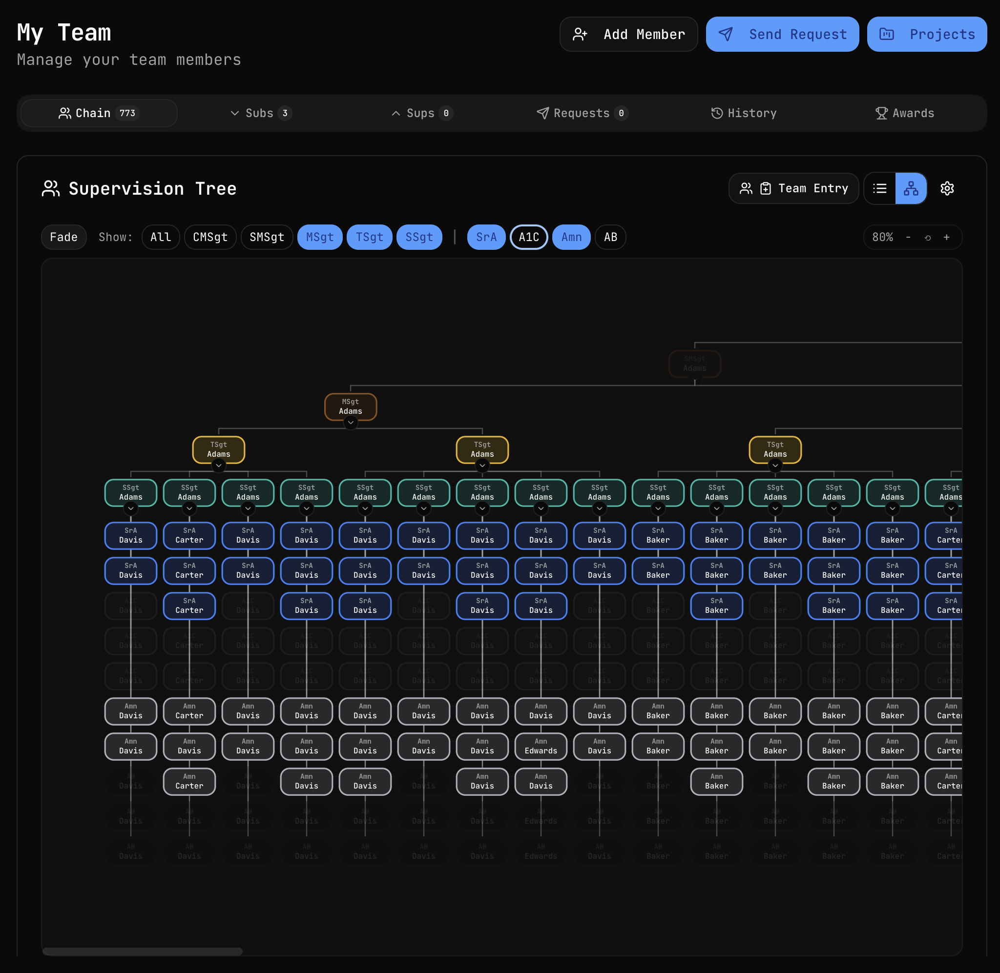
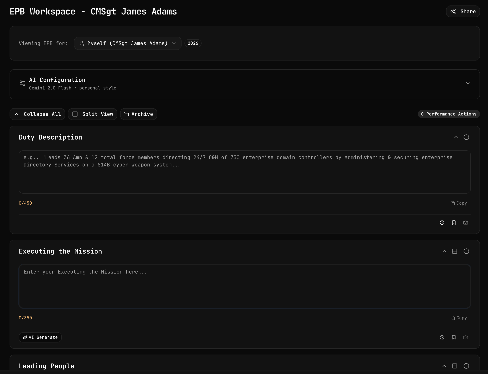
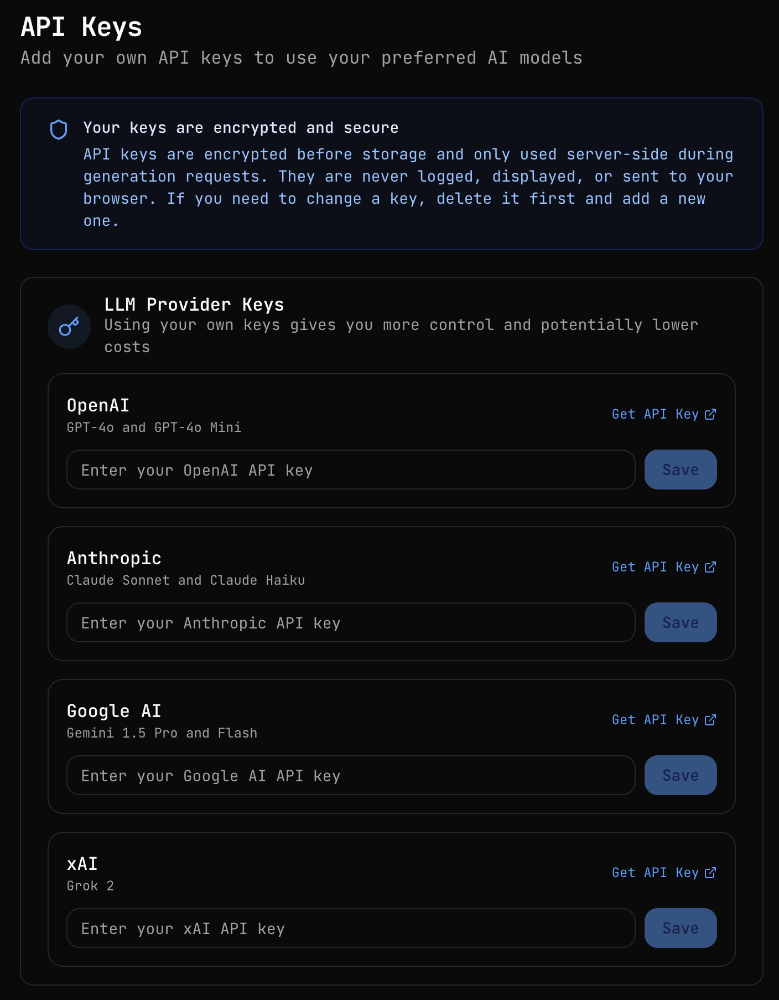

# My EPBuddy

**Your AI-Powered Air Force Performance Brief Assistant**

My EPBuddy is a comprehensive web application designed for Air Force supervisors and their teams to efficiently track accomplishments, manage team hierarchies, and generate high-quality Enlisted Performance Brief (EPB) narrative statements compliant with AFI 36-2406.

---

## Screenshots

### Team Supervision Tree


Visualize and manage your entire supervision chain with an interactive hierarchical tree view. Filter by rank, zoom for large organizations, and quickly navigate your team structure.

### EPB Workspace


The AI-powered workspace for generating and refining EPB statements. Features real-time collaboration, AI configuration, split view editing, and character counting—all in one streamlined interface.

### API Key Management


Bring your own API keys for OpenAI, Anthropic, Google AI, or xAI. Keys are encrypted and stored securely, giving you control over costs and ensuring reliable access.

---

## Key Features

### AI-Powered Statement Generation
- **Multi-Model Support** - Choose from GPT-4o, Claude Sonnet/Haiku, Gemini 2.0 Flash, or Grok 2
- **Three Writing Styles** - Personal (your refined examples), Community (crowdsourced), or Hybrid
- **Smart Context** - AI considers rank, AFSC, and accomplishment history for tailored statements
- **Character Optimization** - Automatically fits statements within the 350-character myEval limit

### EPB Workspace
- **Section-by-Section Editing** - Duty Description, Executing the Mission, Leading People, Managing Resources, Improving the Unit
- **Split View Mode** - Compare and edit statements side-by-side
- **Real-Time Collaboration** - Multiple users can work on the same EPB with live cursor tracking
- **Section Locking** - Prevents edit conflicts when collaborating
- **AI Generate Button** - One-click generation per section with accomplishment context
- **Archive & History** - Archive completed EPBs and track statement evolution

### Team Management
- **Supervision Tree Visualization** - Interactive org chart with 700+ member support
- **Rank-Based Filtering** - Toggle visibility by rank tier (CMSgt through AB)
- **Zoom & Pan Controls** - Navigate large hierarchies effortlessly
- **Multi-Tab Organization** - Chain, Subs (subordinates), Sups (supervisors), Requests, History, Awards
- **Managed Members** - Track team members who don't have accounts
- **Team Activity Feed** - Real-time accomplishment updates from your entire chain

### Award Packages (AF Form 1206)
- **Full 1206 Support** - Create and manage award nominations for quarterly and annual awards
- **Award Categories** - Amn, NCO, SNCO, CGO, FGO, Civilian categories
- **Period Configuration** - Annual, Quarterly, or Custom date ranges with fiscal/calendar year options
- **Workspace Integration** - Same powerful editing experience as EPB workspace

### Statement Library
- **Personal Library** - Save and organize your refined statements
- **Shared Statements** - Share statements with team members or your entire supervision chain
- **Community Statements** - Crowdsourced examples filtered by AFSC with voting system
- **Statement Workspace** - Combine and refine multiple statements into one
- **Archived EPB Filter** - Quickly find statements from previous performance cycles

### Secure API Key Management
- **Bring Your Own Keys** - Use your personal API keys for OpenAI, Anthropic, Google AI, or xAI
- **Encrypted Storage** - Keys are encrypted before storage and never exposed to the browser
- **Provider Status** - Visual indicators show which providers are configured
- **Cost Control** - Using your own keys gives you direct billing and higher rate limits

### Officer Support
- **OPB Workspace (Beta)** - Officer Performance Brief generation for commissioned officers
- **Team EPB Mode** - Officers can generate and manage EPBs for their enlisted subordinates
- **Rank-Aware UI** - Interface adapts based on whether user is officer, NCO, or junior enlisted

---

## Technical Features

- **Real-Time Collaboration** - Supabase Realtime powers live cursor tracking and section locking
- **Responsive Design** - Optimized for desktop, tablet, and mobile
- **Dark/Light Mode** - System-aware theme switching
- **Row Level Security** - Database-enforced access control for all data
- **Version Checking** - Automatic app update notifications
- **Idle Detection** - Collaboration presence management
- **Confetti Celebrations** - Fun feedback when archiving completed EPBs

---

## Tech Stack

| Category | Technology |
|----------|------------|
| **Framework** | Next.js 15+ (App Router, Turbopack) |
| **Language** | TypeScript |
| **Styling** | Tailwind CSS 4 + shadcn/ui |
| **Database** | Supabase (PostgreSQL) |
| **Authentication** | Supabase Auth (Email/Password, Google OAuth) |
| **AI SDK** | Vercel AI SDK (OpenAI, Anthropic, Google, xAI providers) |
| **State Management** | Zustand |
| **Real-Time** | Supabase Realtime (Broadcast, Presence) |
| **Icons** | Lucide React, Hugeicons |
| **Deployment** | Vercel |

---

## Getting Started

### Prerequisites

- Node.js 18+
- npm, pnpm, or yarn
- Supabase account (free tier works)
- API key for at least one AI provider (OpenAI, Anthropic, Google, or xAI)

### Installation

1. **Clone the repository:**
```bash
git clone https://github.com/yourusername/myepbuddy.git
cd myepbuddy
```

2. **Install dependencies:**
```bash
npm install
```

3. **Configure environment variables:**
```bash
cp env.example .env.local
```

Update `.env.local` with your values:
```env
# Supabase (Required)
NEXT_PUBLIC_SUPABASE_URL=your_supabase_project_url
NEXT_PUBLIC_SUPABASE_ANON_KEY=your_supabase_anon_key
SUPABASE_SERVICE_ROLE_KEY=your_supabase_service_role_key

# App URL
NEXT_PUBLIC_APP_URL=http://localhost:3000

# Fallback LLM API Keys (at least one recommended)
OPENAI_API_KEY=your_openai_api_key
ANTHROPIC_API_KEY=your_anthropic_api_key
GOOGLE_GENERATIVE_AI_API_KEY=your_google_api_key
XAI_API_KEY=your_xai_grok_api_key
```

### Database Setup

1. Create a new Supabase project at [supabase.com](https://supabase.com)

2. Run the migrations using Supabase CLI:
```bash
# Local development
npm run db:push:local

# Remote/Production
npm run db:push:remote
```

3. Enable Google OAuth (optional):
   - Go to Authentication > Providers in Supabase Dashboard
   - Enable Google provider and configure OAuth credentials

### Running Locally

```bash
npm run dev
```

Open [http://localhost:3000](http://localhost:3000) in your browser.

---

## User Guide

### For All Users

#### Dashboard
- View your current cycle information and SCOD date
- Quick access buttons to create entries and generate EPBs
- See pending account links and prior data reviews
- Supervisors see team activity feed with recent accomplishments

#### Adding Accomplishments
1. Navigate to **Entries** from the sidebar
2. Click **New Entry**
3. Fill in the structured form:
   - **Date** - When the accomplishment occurred
   - **MPA** - Major Performance Area (Executing Mission, Leading People, etc.)
   - **Action Verb** - Strong verb describing what you did
   - **Details** - What you accomplished
   - **Impact** - Results and outcomes
   - **Metrics** - Quantifiable numbers (recommended)

#### Generating EPB Statements
1. Go to **Generate** (EPB Workspace)
2. Select the ratee (yourself or a subordinate)
3. Configure AI settings:
   - Choose your preferred AI model
   - Select writing style (Personal, Community, or Hybrid)
4. Expand each MPA section and click **AI Generate**
5. Review, edit, and refine generated statements
6. Use Split View for side-by-side comparison
7. Archive when complete to save to your library

#### Statement Library
1. Navigate to **Library** to view your saved statements
2. Use tabs to switch between My Library, Shared, and Community
3. Filter by MPA, AFSC, Cycle Year, or Statement Type
4. Use the Workspace to combine statements
5. Share statements with team members

### For Supervisors

#### Managing Your Team
1. Navigate to **My Team**
2. View your supervision chain in the interactive tree
3. Use rank filters to focus on specific tiers
4. Click **Add Member** to add subordinates or managed members
5. Use the **Projects** feature to organize team accomplishments

#### Creating Award Packages
1. Navigate to **Awards**
2. Click **New Award** to create a 1206 package
3. Select the nominee and award category
4. Choose the award period (Annual, Quarterly, or Custom)
5. Use the workspace to generate and refine award statements

#### Sharing EPBs
1. Open an EPB in the workspace
2. Click the **Share** button
3. Share with specific team members or your entire chain
4. Collaborators can view and contribute in real-time

### Adding Your Own API Keys

1. Go to **Settings > API Keys**
2. Enter API keys for any provider:
   - **OpenAI** - GPT-4o, GPT-4o Mini
   - **Anthropic** - Claude Sonnet, Claude Haiku
   - **Google AI** - Gemini 1.5 Pro, Gemini 2.0 Flash
   - **xAI** - Grok 2
3. Keys are encrypted before storage
4. Delete and re-add keys if you need to update them

---

## Project Structure

```
src/
├── app/
│   ├── (app)/              # Protected app routes
│   │   ├── dashboard/      # Home dashboard
│   │   ├── entries/        # Accomplishment entries
│   │   ├── generate/       # EPB/OPB workspace
│   │   ├── library/        # Statement library
│   │   ├── team/           # Team management
│   │   ├── award/          # Award packages (1206)
│   │   ├── settings/       # User settings & API keys
│   │   └── admin/          # Admin configuration
│   ├── (auth)/             # Authentication routes
│   │   ├── login/
│   │   └── signup/
│   ├── api/                # API routes
│   │   └── generate/       # AI generation endpoints
│   └── actions/            # Server actions
├── components/
│   ├── dashboard/          # Dashboard components
│   ├── entries/            # Entry form components
│   ├── epb/                # EPB shell & workspace
│   ├── opb/                # OPB shell (officers)
│   ├── team/               # Team management
│   ├── award/              # Award package components
│   ├── library/            # Statement library
│   ├── generate/           # Generation workspace
│   ├── layout/             # App layout (sidebar, header)
│   └── ui/                 # shadcn/ui components
├── hooks/
│   ├── use-realtime-cursors.ts    # Live cursor collaboration
│   ├── use-section-locks.ts       # Collaborative locking
│   ├── use-epb-collaboration.ts   # EPB real-time sync
│   └── use-workspace-collaboration.ts
├── lib/
│   ├── supabase/           # Supabase clients
│   ├── constants.ts        # App constants, ranks, MPAs
│   ├── encryption.ts       # API key encryption
│   └── utils.ts            # Utility functions
├── stores/                 # Zustand state stores
└── types/                  # TypeScript types
```

---

## Environment Variables

| Variable | Description | Required |
|----------|-------------|----------|
| `NEXT_PUBLIC_SUPABASE_URL` | Supabase project URL | Yes |
| `NEXT_PUBLIC_SUPABASE_ANON_KEY` | Supabase anon key | Yes |
| `SUPABASE_SERVICE_ROLE_KEY` | Supabase service role key | Yes |
| `NEXT_PUBLIC_APP_URL` | Your app URL | Yes |
| `OPENAI_API_KEY` | OpenAI API key (fallback) | Recommended |
| `ANTHROPIC_API_KEY` | Anthropic API key (fallback) | Optional |
| `GOOGLE_GENERATIVE_AI_API_KEY` | Google AI key (fallback) | Optional |
| `XAI_API_KEY` | xAI/Grok API key (fallback) | Optional |

---

## Deployment

### Deploy to Vercel

1. Push your code to GitHub

2. Import to Vercel:
   - Go to [vercel.com](https://vercel.com)
   - Import your GitHub repository
   - Configure environment variables
   - Deploy

3. Configure Supabase for production:
   - Update OAuth redirect URLs
   - Ensure RLS policies are active
   - Set up database backups

---

## Contributing

1. Fork the repository
2. Create a feature branch (`git checkout -b feature/amazing-feature`)
3. Make your changes
4. Commit your changes (`git commit -m 'Add amazing feature'`)
5. Push to the branch (`git push origin feature/amazing-feature`)
6. Open a Pull Request

---

## License

MIT License - see LICENSE file for details.

---

## Disclaimer

This application is not affiliated with, endorsed by, or connected to the U.S. Air Force, Department of Defense, or any government entity. It is a personal productivity tool designed to assist with EPB preparation.

---

Built with care for Air Force supervisors and their teams.
